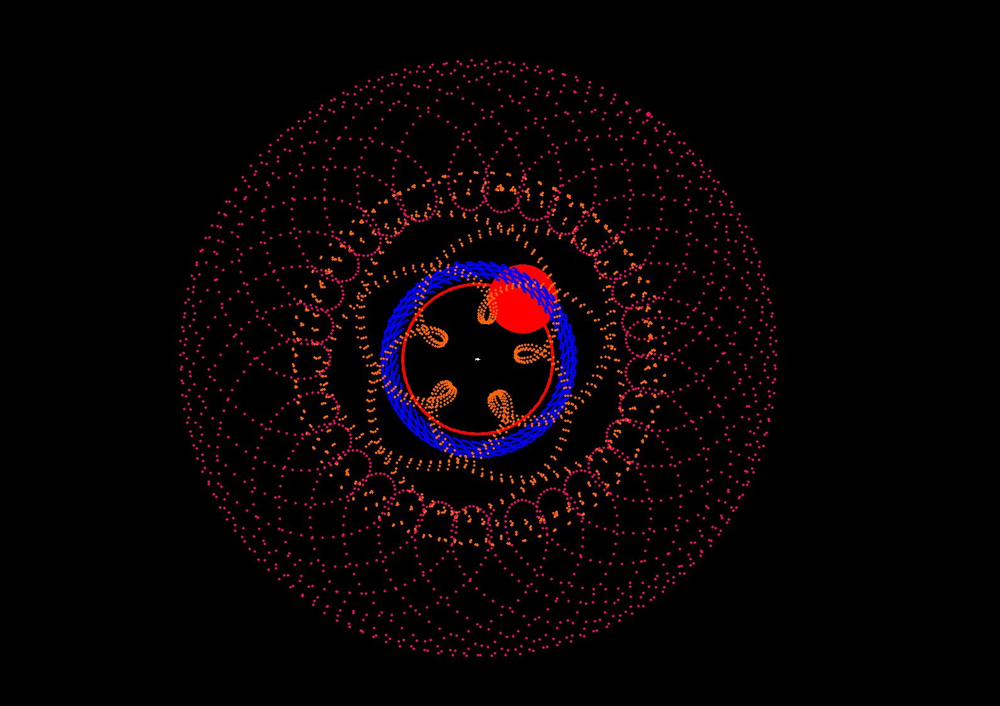
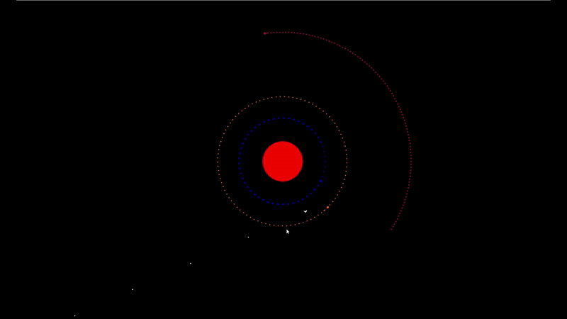

# Simulation de la gravité 

Un simulateur de système planétaire avec physique réaliste et contrôle de vaisseau spatial, implémenté en Python avec Pygame.

   
  

  
   
  <em>Capture d'écran, orbites des planètes dans le référentiel du vaisseau</em>

## Fonctionnalités Clés

<table>
  <tr>
    <td width="30%">
      <h3> Physique Réaliste</h3>
      <ul>
        <li>Gravité newtonienne </li>
        <li>Algorithme de Verlet pour l'intégration</li>
      </ul>
    </td>
    <td width="30%">
      <h3> Contrôles </h3>
      <ul>
        <li>Pilotage de vaisseau spatial</li>
        <li>Choix du référentiel</li>
        <li>Système de verrouillage</li>
      </ul>
    </td>
    <td width="30%">
      <h3> Visualisation</h3>
      <ul>
        <li>Trajectoires prédictives</li>
        <li>Corps célestes à l'échelle</li>
        <li>Indicateurs de vitesse</li>
      </ul>
    </td>
  </tr>
</table>

  

